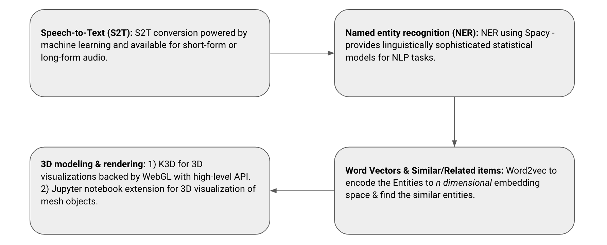

### Project JARVIS  
- Given an audio description of the orientation of an object, the code should generate and renders the 3D model of that description.  
- We used [Spacy](https://spacy.io/) for NER recognition followed by Google's pre-trained word2vec embeddings to recommend the relevant entities to our target entity recognized from the scene.  
- [K3D-Jupyter](https://k3d-jupyter.readthedocs.io) - a Jupyter notebook 3d visualization package used to render 3d objects.    

**Note:** This repository code isn't optimized in any aspect. 

### Input:  
- Audio Instructions to place 3d objects in the scene
- Example input: `Add me a table to the scene`  

### Output:  
- 3D models Rendering for Virtual Reality  
- Suggest relevant items to the rendered scene 

### Pipeline:
  
  

### Sample Output:  
  

